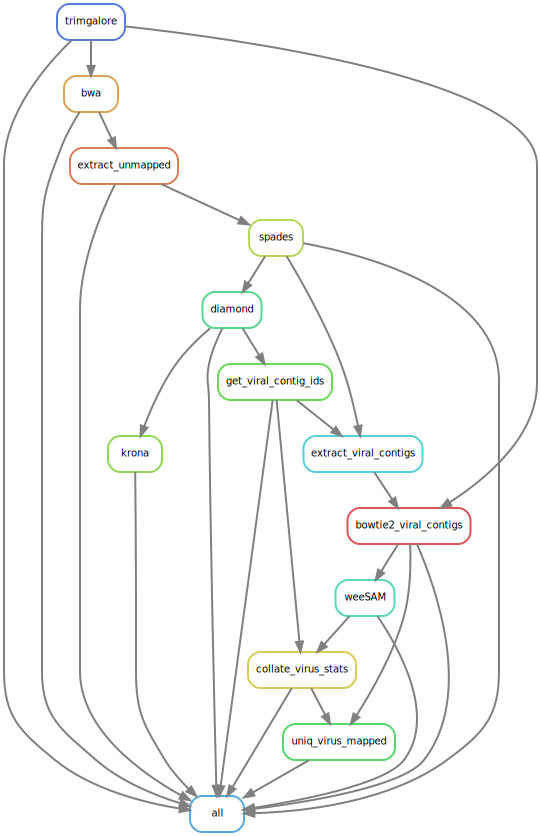

### _Metagenomics with host depletion_

## Installation

Download the repo from github and then create the conda envionment with

``conda env create -f metagenomics.yml``

Activate the environment

``conda activate metagenomics``

## Running

Modify the paths in `config.yaml` to provide:

* the path to the directory with all the fastq files, 
* the output directory
* the path to the host genome
* the path to the diamond database
 
``snakemake -s /path/to/MetagenomicWithHostDepletion.snake -j 8``

Use `-j` to specify the number of concurrent threads you can use. 

## Pipeline overview

Currently the pipeline looks like this:
